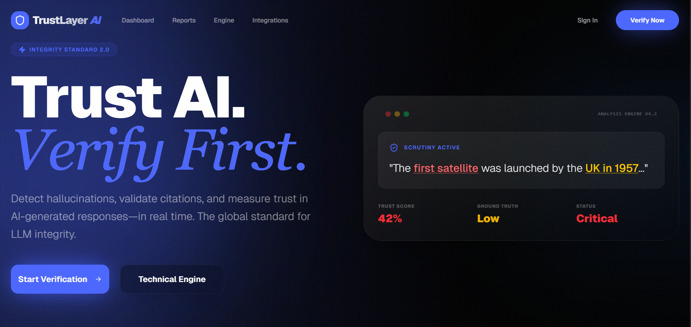
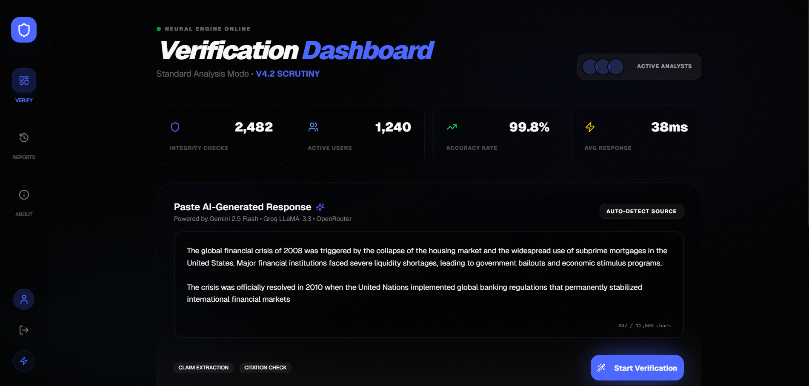
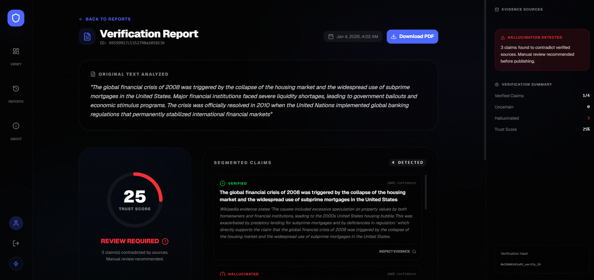
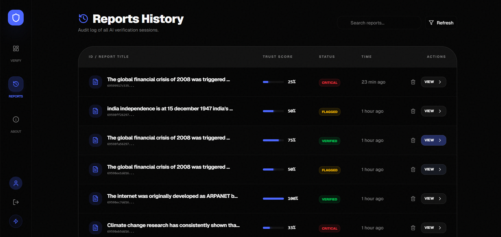
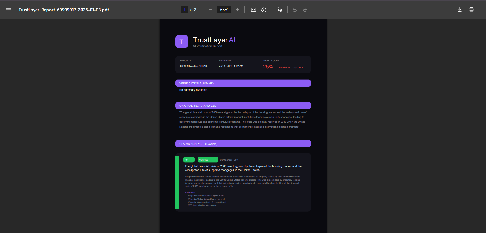
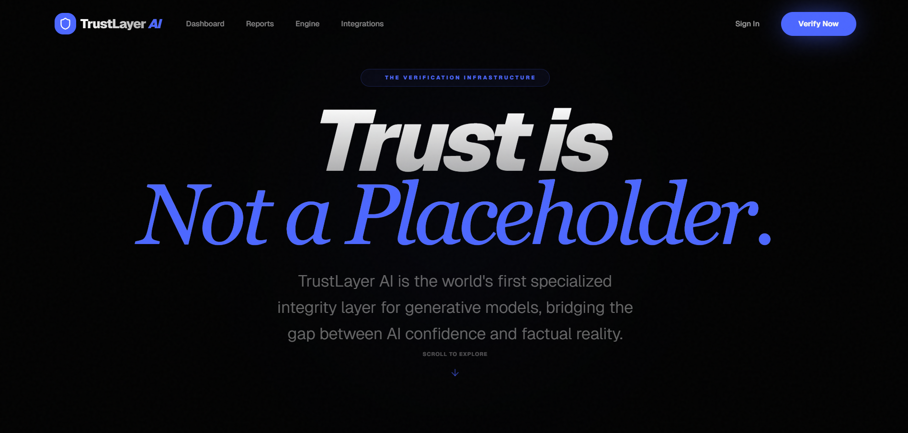
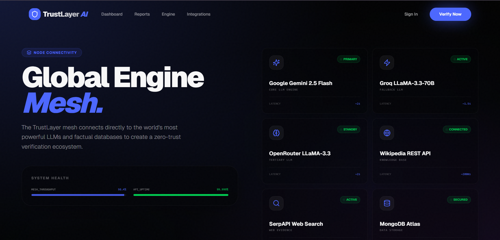

# TrustLayer AI – Hallucination & Citation Verification System

## Team Name

Team-99

## Problem Statement (PS-03)

AI Hallucination and Citation Verification System

Generative AI models are widely used for research, learning, and decision
making. However, these models often generate factually incorrect information
presented with high confidence.

A critical extension of this problem is the creation of fake citations, non-existent
references, and broken links, which appear legitimate but cannot be verified.
This makes it difficult for users to trust AI-generated content and may lead to
misinformation, legal risks, and ethical concerns.

Build a system that can detect, flag, and verify factual claims and citations
generated by AI models, helping users distinguish between reliable and
unreliable AI-produced information.

## Project Overview

TrustLayer AI is a hackathon-ready, scalable verification platform for AI-generated content. It ingests LLM outputs, breaks them into atomic claims, cross-checks each claim against authoritative sources (Wikipedia REST API, SerpAPI web search), detects hallucinations, validates citations, and assembles a defensible evidence trail. Users get a trust score, per-claim status (verified, uncertain, or hallucinated), evidence snippets, and a downloadable PDF report aligned to the UI theme.

## Key Features

- Claim-level hallucination detection with strict confidence thresholds (85%+, 90% for absolute claims)
- Multi-source verification: Wikipedia entity lookup and live web search via SerpAPI
- Citation validation and misquote detection with evidence snippets
- Trust score calculator with verified/uncertain/hallucinated breakdown
- Dark-themed PDF report generation matching the dashboard layout
- Multi-LLM fallback: Google Gemini 2.5 Flash → Groq LLaMA-3.3-70B → OpenRouter

## Deployed Links

- Frontend: <https://trustlayer-frontend.vercel.app/>
- Backend: <https://trustlayer-backend.onrender.com/api>

## 2-minute Demonstration Video

Pending (to be recorded during demo session)

## PPT Link

Pending (deck is being finalized for judging)

## Setup and Installation

### Backend

1. Navigate to the backend directory.
2. Copy .env.example to .env.
3. Add MongoDB URI and API keys for Gemini, Groq, OpenRouter, and SerpAPI.
4. Install dependencies: npm install
5. Run locally (hot reload): npm run dev
6. Build and run production bundle: npm run build then npm start

### Frontend

1. Navigate to the frontend directory.
2. Create .env.local and set NEXT_PUBLIC_API_URL=<https://trustlayer-backend.onrender.com/api> (or <http://localhost:4000> for local backend).
3. Install dependencies: npm install
4. Run locally (Next.js dev server): npm run dev
5. Build and serve production bundle: npm run build then npm start

## Usage Instructions

Start the backend and ensure it connects to MongoDB and the configured AI and search providers. Start the frontend and open the application in the browser. Paste AI-generated text into the dashboard to initiate verification. Review trust scores, per-claim classifications, inspect supporting evidence, and download the generated PDF report.

## Screenshots

### Home Page

### Dashboard - Live Verification

### Claims & Evidence

### Reports List

### PDF Report

### About Page

### Integrations

## Team Members

- Shashikant Rajput (Team Lead)
- Hemant Yadav
